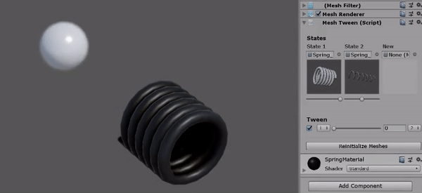

# Unity_Tween

Version 0.22

Simple tweening system with easing.

```
public enum TaskType {
    move,
    moveLocal,
    moveArc,
    moveArcLocal,
    rotate,
    rotateLocal,
    scale,
    colorMaterial,
    colorSprite,
    actionFloat,
    timerSimple,
    moveUI,
    tweenMesh
};

Tween.a.MoveTo(what, where, time, ease, callback);
```

## Adding to a project
1. Add Tween.cs to a GameObject

## Usage examples

```csharp
using FMLHT;
```

Moving:

```csharp
Tween.MoveTo(objTransform, new Vector3(0, 100, 0), 3f, Easing.Ease.Linear, () => {
    //I've been moved!
});
```

Rotating locally:

```csharp
Tween.RotateToLocal(objTransform, Quaternion.Euler(rotationTo), 3f, Easing.Ease.EaseOutElastic, () => {
    //I've been rotated!
});
```

Complex tween:

```csharp
Action<float> order66 = f => {
    jediCount = Mathf.Lerp(jediCountTotal, 0, f);
    empireStregth = 1 - f;
    saberLight = Color.Lerp(Color.blue, Color.red, f);
};
Tween.ActionFloat(order66, 0f, 1f, 10f, Easing.Ease.EaseInExpo);
```

Action is returned as `Task`, so that you can refer to it later:

```csharp
Tween.Task tomJob;
void BeginJob() {
    //Catch Jerry!
    tomCheck = Tween.DoAfter(10f, () => {
        if (!Jerry.isCaught) {
            Tom.BeginJob();
        }
    });
}

///

void Update() {
    if (Jerry.isCaught) {
        Tween.DeleteTask(tomCheck);
    }
}
```

## Tween mesh

1. Add component ```MeshTween``` to an empty mesh.   
2. Assign meshes with equal vertex count to new states
3. Ajust tween value in inspector or in script:

```csharp
//Directly with method
tweenMesh.SetState(0, 1f);
tweenMesh.SetState(1, 0f);
tweenMesh.UpdateCurrentState();

//Tween with method
//Updates automatically
tweenMesh.Between(0, 1, 0f);

//Directly to objects
tweenMesh.states[0].Weight = 1f;
tweenMesh.states[1].Weight = 0f;
tweenMesh.UpdateCurrentState();

//Animated
Tween.TweenMesh(
    tweenMesh, //MeshTween
    0,         //state from
    1,         //state to
    0f,        //value from
    1f,        //value to
    0.5f,      //time
    Easing.Ease.Linear
    );
```